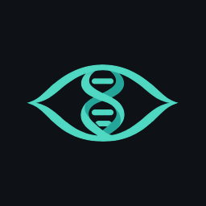

# Helix Peek branding

An eye surrounding a DNA double helix: the subject and the act of looking in
one symbol. Mint and teal sit on the app's navy `#0E1116` surface. The app's
Space Grotesk wordmark stays live text for crisp rendering and accessibility.



## Files to use

| File | Purpose |
| --- | --- |
| `helix_peek_master.png` | Original generated RGBA master, 1254 × 1254; real transparency |
| `exports/logo-{size}.png` | Transparent square logo, centered with clear space |
| `exports/app-icon-{size}.png` | Opaque navy square icon, ready for platform masking |
| `generated/app_icon.png` | 1024 × 1024 source for iOS, Android legacy, and web icons |
| `generated/adaptive_foreground.png` | Transparent Android foreground with safe-zone padding |
| `generated/adaptive_monochrome.png` | White alpha silhouette for Android themed icons |
| `generated/desktop_icon.png` | Rounded desktop tile with transparent outer margin |

Both export sets contain **32, 48, 64, 128, 256, 512, and 1024 px** squares.
These are PNG assets, not vector artwork. The generated master is preserved;
all smaller assets are derived from it without upscaling.

## Flutter usage

```dart
import 'package:helixpeek/shared/widgets/app_logo.dart';

const AppLogo(width: 96);

// When the app name is already present next to the image:
const AppLogo(width: 96, excludeFromSemantics: true);
```

The mark has a 2:1 layout box. Runtime assets are 128 × 64, 256 × 128,
384 × 192 and 512 × 256 in the standard base/`2.0x`/`3.0x`/`4.0x` folders.
Only the base asset is declared in `pubspec.yaml`; Flutter bundles and selects
the variants automatically. Use the shared widget instead of hard-coding
density paths. The home screen includes it above the existing wordmark.

The source master, shareable exports and launcher sources are outside the
Flutter asset bundle. Image tooling is a development dependency only.

## Regenerate

From the app directory:

```sh
flutter pub get
dart run tool/branding/generate.dart
```

The command validates the master, exports the sizes, invokes
`flutter_launcher_icons.yaml`, then writes the maskable web icons, 180 px Apple
touch icon, Windows ICO frames, and embedded Linux icon. Commit the generated
assets together with the master and configuration. A replacement master needs
real transparency and at least 1024 × 512 pixels of visible artwork.

- **Android:** legacy mipmaps, separate navy adaptive background, transparent
  foreground and Android 13+ monochrome layer. Artwork fits inside the central
  66dp safe zone of the 108dp layer. The configured inset is zero because the
  foreground already contains its padding.
- **iOS:** opaque icons with no alpha and no baked-in rounded corners. The OS
  supplies the final mask. The 1024 px icon is included in the asset catalog.
- **Web:** 192/512 px icons and separate maskable variants, a favicon, an Apple
  touch icon, and matching manifest/theme colors. Maskable artwork fits inside
  the central safe circle.
- **macOS:** all asset-catalog sizes use the rounded desktop tile.
- **Windows:** the ICO contains 16, 24, 32, 48, 64, 128 and 256 px frames.
- **Linux:** a GResource embeds the window icon in the executable. Desktop
  distribution packaging must also install a `.desktop` entry and themed icon
  using its application ID; some desktop shells use those instead of the
  window icon. There is no Linux distribution packaging in this repository yet.

Launcher changes require a full rebuild and reinstall; hot reload updates
Flutter widgets, not installed OS icons. Desktop shells and browsers may also
cache old icons.

References: [Flutter image assets](https://docs.flutter.dev/ui/assets/assets-and-images#resolution-aware-image-assets),
[launcher generator](https://pub.dev/packages/flutter_launcher_icons),
[Android adaptive icons](https://developer.android.com/develop/ui/compose/system/icon_design_adaptive).
