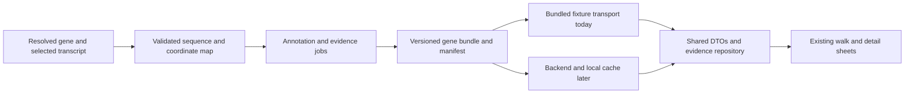

**AlphaGenome opportunities for Helix Peek**

Analysis date: 22 September 2026. Reviewed mobile `e1ec420`, backend `9e099f1`, and the local AlphaGenome client `aa6fc8f`. This is a product and integration proposal; application behavior is unchanged.

**Recommendation**

Add an explanation of **what contributes to each substitution's AVI score**, inside the existing base inspector and expanded variant detail. Follow it with a compact reference/alternate splice comparison for selected variants. Tissue context belongs inside these explanations, with a broader expression comparison considered later.

The existing walk remains search → gene → mRNA → protein → mature chains where applicable → structure. These additions explain events along that walk without adding a mandatory stage, a new navigation destination, or another global score.

**What is already present**

| Surface | Current behavior | Opportunity |
|---|---|---|
| Search | Filters 20 catalog entries locally | Keep the same entry point |
| Gene | Annotated regions; selected regions can open into bases; AVI region summaries | Explain a selected base or splice boundary within its current detail |
| mRNA / opened DNA | Three substitution AVI bars; synonymous changes marked `=` | Explain why the individual alternative scores as it does |
| Protein | ESM-2 residue alternatives and constraint; links between bases and residues | Preserve protein context; add DNA explanations through the existing links |
| ClinVar | Exact-allele records, expandable detail, overview, return navigation | Add attribution to the already selected allele |
| Mature chains / structure | Processing annotations and baked molecular scenes | AlphaGenome does not provide the protein processing or folding outputs needed to replace these |

The assets are substantive biological fixtures, not invented example scores. `tool/impact/bake_impact.py` already queries Atlas, maps GRCh38 to the app's record coordinates, complements alleles where needed, and stores three AVI values per scored base. It requests only `AVI_SCORE`, so the explanatory information is currently discarded at the source.

Key implementation references: [impact bake](../tool/impact/bake_impact.py), [GeneImpact](../lib/features/gene_lookup/domain/entities/gene_impact.dart), [ImpactPanel](../lib/features/gene_lookup/presentation/inspector/impact_panel.dart), [EvidenceDetail](../lib/features/gene_lookup/presentation/clinvar/evidence_row.dart), and [pipeline rules](protein-pipeline-rules.md).

**What AlphaGenome supplies directly**

There are two useful access paths. Atlas retrieves precomputed variant scores and attributions. The prediction client produces reference/alternate tracks for genomic intervals. Neither path supplies finished Flutter interactions; interpretation, coordinate projection, compact serialization, and UI remain app work.

| Capability | Available output / method | Fit and priority |
|---|---|---|
| Explain the existing AVI | Atlas `AVI_SCORE_FEATURE_IMPORTANCE`, 18 feature values | Best first addition; extends an existing score |
| Inspect a variant's molecular effects | Atlas RNA, splice, accessibility and other scorers; gene and ontology filters | Good source for concise, explicitly scoped explanations |
| Show the changed splice pattern | `predict_variant`: `SPLICE_SITES`, `SPLICE_SITE_USAGE`, `SPLICE_JUNCTIONS`, with `RNA_SEQ` | Strong second addition; needs additional track predictions |
| Compare expression contexts | `predict_interval`, `score_interval`, or variant RNA-seq scores | Useful later; track selection and comparability need validation |
| Explain accessibility / regulatory activity | ATAC, DNase, CAGE, PRO-cap, ChIP-TF, ChIP-histone | Good inside variant details; a full regulatory browser would expand the flow |
| Explore polyadenylation | Atlas `POLYADENYLATION`, or the RNA-seq-based variant scorer | Potential future 3′ UTR detail; not a separate direct output head |
| DNA contact maps | `CONTACT_MAPS` | Low priority; describes chromatin contacts, not the protein fold |
| Predict indel effects | Prediction client supports indels | Later: current app evidence and allele UI are built around SNVs |
| Full alternative proteins, peptide cleavage, protein structure | Not supplied as these outputs | Continue using annotation, protein models and structural sources |

The [official Atlas announcement](https://deepmind.google/blog/alphagenome-atlas-a-predictive-map-of-every-possible-dna-letter-change-in-the-human-genome/) confirms precomputed scores, AVI feature attributions, and protein evidence from AlphaMissense. Exact client interfaces were checked in the local [Atlas client](../../alpha-genome/alphagenome/src/alphagenome/atlas/atlas.py), [DNA client](../../alpha-genome/alphagenome/src/alphagenome/models/dna_client.py), [output types](../../alpha-genome/alphagenome/src/alphagenome/models/dna_output.py), and [scoring documentation](../../alpha-genome/alphagenome/docs/source/variant_scoring.md).

**Live feasibility check using variants already shipped**

Queried Atlas metadata and three existing catalog variants using the workspace's [AVI skill](../../.claude/skills/alphagenome-variant-impact-score/SKILL.md). Links were generated with its [Atlas linking companion](../../.claude/skills/alphagenome-atlas-website-links/SKILL.md). The saved [query results](research/alphagenome-feasibility-samples.json) contain all feature values and the helper's selected track provenance. These are precomputed lookups; no new sequence inference was run.

| Existing variant | Live AVI, rounded | Largest individual attribution | Product implication |
|---|---:|---|---|
| [INS c.71C>A, p.Ala24Asp](https://deepmind.google.com/science/alphagenome/atlas?q=chr11:2160901:G%3ET&m=variant&lItems=avi,section:RNA_SEQ,section:DNASE,section:CHIP_TF) | 23.1 | Cactus evolutionary conservation; AlphaMissense also contributes strongly | Explain conservation and protein evidence; do not force every result into a regulatory category |
| [HBB c.92+1G>A](https://deepmind.google.com/science/alphagenome/atlas?q=chr11:5226929:C%3ET&m=variant&lItems=avi,section:RNA_SEQ,section:DNASE,section:CHIP_TF) | 35.1 | Splicing | Natural connection to the gene → mRNA transition |
| [CFTR c.2619G>A, p.Glu873=](https://deepmind.google.com/science/alphagenome/atlas?q=chr7:117595058:G%3EA&m=variant&lItems=avi,section:RNA_SEQ,section:DNASE,section:CHIP_TF) | 33.6 | Splicing | Explains how a change retaining the encoded amino acid can still have predicted RNA effects |

All three agree with the bundled AVI values at their stored one-decimal precision. This validates feasibility for these examples, not every gene or every proposed feature.

The CFTR example supports wording such as “Same encoded amino acid. Splicing contributes most to this AVI score.” It does not establish a specific skipped exon, altered mature protein, or clinical outcome. A splice-pattern claim requires the corresponding track comparison.

There is a useful scope trap in the INS result: the helper selects an `INS-IGF2` track for a splice contribution, despite the app displaying INS. For HBB, its maximum splice-related track is labeled stomach. These are selected maxima across available tracks, not evidence that these are the gene's principal tissue or the reader's desired biological context. Preserve the target gene, biosample, assay and strand; distinguish an across-context attribution from a selected-gene/tissue effect.

**First feature: “What contributes to this score?”**

In an expanded ClinVar record, the allele is already unambiguous. Place a short explanation below its existing molecular evidence line, followed by an optional expansion showing the leading contributions and provenance.

In the base inspector, make each existing substitution row expandable or selectable. Expanding `A` explains that exact alternative; expanding `T` changes the explanation to `T`. Keep the three bars and existing sheet gestures. Do not silently attach the highest-scoring alternative's explanation to the base as a whole. A user who never expands a row sees the familiar flow.

Show at most two or three leading contributions initially. Preserve neutral model styling and the existing ClinVar colors. Use deterministic wording from structured values, so every sentence can be traced to its source without a language-model dependency.

Interpretation rules:

- Feature attributions explain the AVI model's raw result. They are not percentages of biological causation, disease probabilities, or additive components of the displayed Phred value.
- Retain signed values. “Raises the score” requires a positive attribution; a large negative attribution can be influential while lowering the score. The helper picks the largest absolute value, so its `top_modality` alone is insufficient for that wording.
- A positive attribution is not necessarily increased expression. Direction must come from a signed molecular effect or a reference/alternate track comparison.
- Conservation and AlphaMissense must remain visible when they dominate. AVI and ESM are not independent votes to be combined into a confidence score.
- Exact allele, assembly and reference matching are required. Never borrow an attribution from a neighboring base. Existing estimated AVI rows should have no exact mechanism explanation.
- Include an optional Atlas source link; details remain usable offline.

For a first release, bake complete attribution coverage for INS, HBB and CFTR, then expand to the other genes after payload and interaction review. Alternatively, a smaller exploratory build can include selected variants, but must explicitly label that coverage and never imply missing explanations mean no effect.

**Second feature: a splice comparison inside existing details**

Give an intron boundary or splice-related variant an expandable local view: annotated exons, donor/acceptor labels, and reference/alternate junctions. Pair the junction picture with a small RNA-seq coverage plot for the same window and an appropriate matching biosample. This explains both the predicted junction pattern and associated RNA signal.

The annotation supplies the known transcript structure. Additional `predict_variant` calls supply the predicted comparison. Atlas aggregate splice scores alone do not reconstruct complete reference and alternate junction diagrams. A splice-site probability, site-usage fraction and junction read signal also have different meanings and units; do not put them on one interchangeable percentage scale.

Keep the canonical mRNA/protein walk as the annotation-backed molecule. The comparison is a local prediction layer. Do not automatically animate a predicted skipped exon into a new protein: junction predictions do not by themselves select a complete, validated alternate transcript or establish its translation and processing.

Start with the verified HBB and CFTR examples, inspect their actual predicted tracks, then choose a small number of informative windows. The current check did not retrieve those tracks, so a convincing splice visualization remains a feasibility step rather than a measured result.

**Third feature: tissue context, initially within variant details**

Show which available biosample and target gene a molecular effect describes. A compact selector can compare a small, reviewed set of contexts when those tracks exist. Treat the global AVI as fixed; changing the selected tissue changes the displayed molecular tracks, not AVI's genome-wide interpretation.

A later reference-expression card could answer “How does predicted RNA signal differ across these contexts?” It needs a consistent assay subset, declared aggregation over the target gene, and track normalization review. Avoid “where this protein is made,” absolute protein abundance, or a whole-body tissue ranking from heterogeneous tracks. Missing tissue data is unavailable, not zero expression. Tissue-specific peptide processing, such as glucagon's alternative products, is a separate annotation problem.

The [official FAQ](https://google-deepmind-alphagenome.readthedocs-hosted.com/faqs.html) documents ontology-backed track selection and limitations in tissue specificity and long-range interactions. The local [output metadata guide](../../alpha-genome/alphagenome/docs/source/exploring_model_metadata.md) describes units, strands and assay differences needed for this design.

**Offline packaging and the eventual backend**

The current `USE_MOCK_DATA` switch replaces only `ApiClient` for gene records. `ProteinConstraint.load`, `GeneImpact.load`, and `GeneClinVar.load` read bundled assets directly, and `AnatomyScreen` calls them. Search metadata is a Dart catalog. Structures use build-compiled scenes through `loadScene`. Consequently, pointing the app at a deployed backend does not yet migrate evidence, catalog data or structures.

Extend the existing transport design with an evidence repository and typed DTOs. The mock transport should serve the same versioned payloads from bundled files that the backend eventually serves. Keep JSON parsing and validation shared, as they already are for gene records. Move asset acquisition out of domain entities and screen code as each evidence type migrates; avoid an unrelated large refactor.

Suggested pipeline:

Use a manifest plus separately loadable evidence payloads, rather than delaying the gene page until all models finish. Proposed resources could be a gene-bundle manifest, impact explanations, and compact splice comparisons keyed by bundle ID. These endpoints do not exist today. Load the core gene first; load evidence on demand or prefetch during the walk. Optional evidence failures should leave the core molecule usable, with local retry and accurate availability state.

The contract should carry:

| Scope | Required identity / provenance |
|---|---|
| Bundle | Schema and bundle version; species, assembly, accession/version; selected transcript/protein IDs; sequence hashes; annotation version; generation date |
| Variant | Chromosome, 1-based genomic position, genomic REF/ALT; separately named display position and display-strand alleles |
| Attribution | Original feature IDs and signed values; raw-score attribution units; scorer; Atlas release if exposed, otherwise retrieval date and client version |
| Effect / plot | Target gene ID, biosample ontology ID and label, assay/track ID and strand; raw score units; prediction window, model version if exposed, track resolution and aggregation |
| Coverage | Ready, unavailable, pending, failed or unsupported; precise missing-data reason; covered intervals and omitted intervals |

Use identity and source versions in cache keys, including the interval and track selection for inference. Hashes and manifest checks should prevent a new transcript from receiving stale evidence. Keep full scientific outputs in offline/server artifacts and only the app's compact projections on mobile. New inference and API credentials stay in the bake/backend environment.

A source-size audit found 186,799 scored displayed bases, or 560,397 substitution scores. Saving 18 float32 attributions for each alternative would add **40.35 MB before metadata or JSON overhead**. Current source JSON records/tracks total 31.23 MB in the asset checker, including 19,021 ClinVar records. These are source-file measurements, not installed-app or compressed-download sizes.

Therefore start with compact leading contributions, deduplicated feature metadata, and a limited number of splice plots. If the UI offers all 18 contributions, download full details later or explicitly include them in the chosen offline coverage. Selecting fewer fields saves transfer/storage; it does not guarantee proportional API quota savings. The Atlas client splits intervals into small requests, and the existing baker already implements pacing/checkpoints for that reason.

Structures need their own delivery investigation: current GLBs are compiled at build time. A backend URL alone is not a verified replacement for that loading path.

**Coordinate and backend prerequisites**

The biggest correctness risk is treating the displayed sequence as the model's genomic input. DMD, APP and CFTR have shortened introns. Their displayed strings are not contiguous reference DNA and must never be sent to `predict_sequence` as if they were. Query authentic GRCh38 intervals, then project outputs through the existing mapping runs. Never join a plot across an omitted intron segment without a visible gap.

The local client accepts precisely 16,384, 131,072, 524,288 or 1,048,576 bases. DMD's approximately 2.09 Mb span cannot fit in one prediction; use explicit windows, retain their boundaries and avoid claiming whole-gene coverage. The [FAQ](https://google-deepmind-alphagenome.readthedocs-hosted.com/faqs.html) recommends the largest context where feasible. Preserve the distinction between 0-based half-open intervals and 1-based variant positions, plus chromosome orientation versus allele complementation.

The backend currently fetches a whole GenBank accession and takes the first mRNA/CDS. Before arbitrary genes can work seamlessly, port the fixture pipeline's selected-isoform handling, chromosome slicing, clipping/compression and processing normalization. The [existing pipeline rules](protein-pipeline-rules.md) document the six fixture-only corrections and the broader resolver work. The backend schema also lacks the display-compression metadata used by current fixtures. Deploying the service is operational work; achieving fixture/live biological parity is additional implementation work.

A gene name alone is not a sufficient bundle identity. Search must resolve a species, locus, transcript and protein before attaching evidence. AlphaGenome supports human/mouse predictions, while this app and its current Atlas mapping are human GRCh38; a general protein search needs an explicit unsupported state outside that scope.

**Implementation order and acceptance criteria**

1. Add a versioned attribution payload, bake support and validation. Pilot INS/HBB/CFTR using the same exact-reference gates as AVI, preserving all raw provenance offline.
2. Serve that payload through the shared mock/live transport seam and add expandable explanations to existing allele rows and variant detail. Verify allele switching, no-detail states, large text, sheet scrolling and existing return navigation.
3. Generate and inspect a small number of splice comparisons, with RNA-seq alongside junctions. Add compact offline plots only after the actual signals support the explanation.
4. Port fixture normalization to the backend and serve the exact generated bundles locally. Compare parsed fixture and local-service bundles, including minus-strand and compressed genes, before deployment.
5. Expand catalog coverage and introduce lazy downloads/caching; evaluate tissue comparisons and remote structure delivery separately.

Meaningful acceptance checks: a changed allele changes its explanation; negative attribution signs survive serialization; missing evidence never becomes zero; the INS overlapping-gene example stays correctly scoped; minus-strand variants round-trip to the same genomic allele; DMD reference mismatches have no exact explanation; compressed gaps never become fabricated contiguous model input; a manifest cannot mix sequence/evidence versions; offline launch and all existing navigation continue to work.

Validation performed for this analysis: `python3 tool/check_assets.py` passed for all 20 targets; live Atlas metadata and the three documented lookups succeeded; bundled/live AVI scores match at stored precision. No Flutter UI changes, backend deployment, or full sequence-prediction benchmark was performed. The strongest supported next step is attribution in existing details; the later visual features still require their own data and interaction validation.
