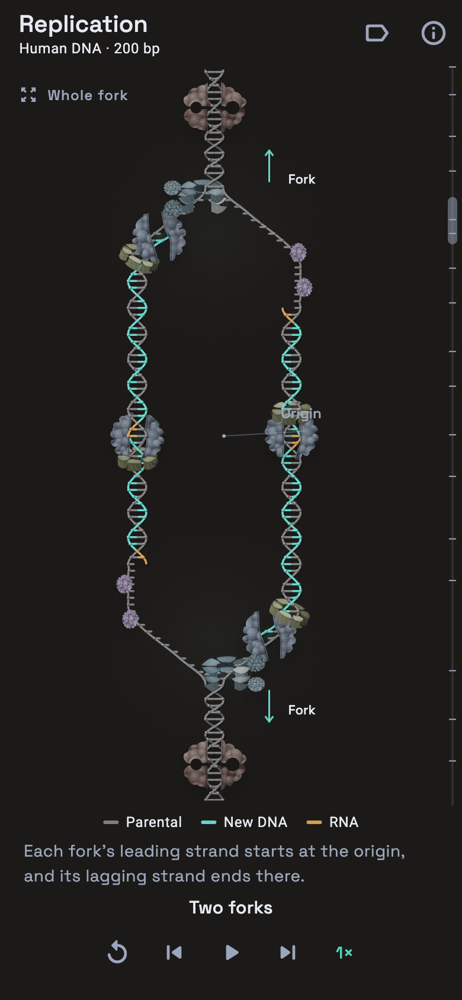

# Genome replication: from an origin to two forks



## Experience

Home → DNA Replication opens an animation immediately, in every build. There is
no protein picker, record download or gene-specific error list. Links from when
it was a lab flow, `/lab/replication` and `/lab/replication/<slug>`, redirect to
this view at `/replication`. The subject is a human origin firing and one of its two
forks followed through an illustrative 200-base-pair stretch with two
100-nucleotide Okazaki fragments.

Playback takes 3 min 32 s at 1×, with 0.25×, 0.5×, 1.5× and 2× available. The
shared Ribosome transport provides pause, replay and chapter stepping. The
walk's vertical scrubber sits beside the scene: dragging pauses and seeks, with
a bubble showing the time and phase. Short captions describe the action below
it. Reduced motion starts on a still. Backgrounding pauses playback, and opening
the research sheet also pauses it. "Whole fork" keeps the whole scene in view at
the current playback time; "Follow steps" resumes the guided framing. Switching
between them glides over half a second (it cuts under reduced motion).

### Chapters

| Playback | View |
| --- | --- |
| 0 s | Origin: an A/T-rich unwinding element; each pair's hydrogen bonds drawn |
| 8 s | Pre-replication complex: ORC and Cdc6 bind; Cdt1 brings two MCM2–7 rings, which close head to head |
| 20 s | Origin firing: Cdc45 and GINS make two CMGs; the origin melts and the CMGs pass each other |
| 30 s | Two forks: the bubble grows both ways; leading strands start at the origin |
| 44 s | The upper fork |
| 48 s | CMG helicase, its ATPase sites firing in turn |
| 58 s | RPA on exposed single strands |
| 68 s | Topoisomerase II relieving the overwound DNA ahead |
| 82 s | Primase building the RNA primer |
| 92 s | RFC loading PCNA; Pol α hands the primer to Pol δ |
| 106 s | Pol ε and continuous leading-strand synthesis |
| 118 s | Pol δ moving away from the fork on the lagging strand |
| 136 s | The next RNA–DNA primer |
| 148 s | A second Okazaki fragment growing towards the first |
| 174 s | Primer replacement: three strokes, FEN1 cutting each flap |
| 188 s | DNA ligase I closing the nick |
| 200 s | Both daughter duplexes, then the camera pulls back to the whole bubble |

Each camera move takes the previous chapter's last 2.5 seconds, with smooth
acceleration and deceleration. Initiation is seen whole (1.35× to 1.7×, then
zoomed out to fit the bubble); the fork's close-ups run from 2.15× to 3×.
Labels keep their size, name only the relevant structures, fade out as the
camera starts to move and fade in as it arrives. In the close-ups each machine
is named with what it is on a second, smaller line.

These are views of concurrent processes. The tour does not imply that
topoisomerase starts only after helicase or RPA. The final chapter shows the
local result while both forks continue; the newest RNA primer awaits the next
fragment beyond this example.

## Research and its consequences

### Origins, licensing and firing

Human origins share no consensus sequence; replication tends to begin in open
chromatin and many origins are G/C-rich. Where DNA first melts, A/T-rich
stretches open most easily: an A·T pair has two hydrogen bonds and a G·C pair
three, and A/T steps stack less tightly. The illustrated origin is drawn A/T-rich
to show this, and the information sheet says so.
[Prioleau & MacAlpine, 2016](https://doi.org/10.1101/gad.285114.116)

In G1, ORC and Cdc6 bind the origin and, with Cdt1, load MCM2–7 as a
head-to-head double hexamer around the duplex: the pre-replication complex.
[Remus et al., 2009](https://doi.org/10.1016/j.cell.2009.10.015)
In S phase, DDK and CDK drive the recruitment of Cdc45 and GINS to each ring,
making two CMG helicases. The CMGs untwist the origin, each closes round one
strand, and, translocating N-terminal tier first, they pass each other and move
apart. [Douglas et al., 2018](https://doi.org/10.1038/nature25787)

The animation loads both rings at once, as mirror images; in cells one ORC
loads them in turn. The kinases are named in the caption and sheet, not drawn.

### Two forks

One origin makes two forks moving in opposite directions. Each fork's leading
strand starts at the origin, and each fork's first Okazaki fragment runs back to
the origin and replaces the other fork's leading primer. The lower fork is drawn
as the upper fork turned 180° about the origin, which is exactly the double
hexamer's two-fold symmetry; in cells the forks move independently.

Replication rebuilt from purified yeast proteins starts leading strands
differently: there is no dedicated leading primer. Pol δ extends each fork's
first lagging-strand primer back across the origin until it reaches the other
fork's CMG, where Pol ε takes over. It has not been shown in human cells, so
the animation keeps the origin primers and the information sheet says so.
[Aria & Yeeles, 2019](https://doi.org/10.1016/j.molcel.2018.10.019)

### Human replisome architecture

Human cryo-EM resolves CMG associated with Pol ε and fork protection factors.
Here CMG's MCM2–7 ring follows the leading template through its central channel;
the lagging template exits outside it. Pol ε remains close behind.
[Jones et al., 2021, core human replisome, PDB 7PFO](https://www.rcsb.org/structure/7PFO)

CMG's six ATPase sites hydrolyse ATP as it unwinds. The C-terminal tier lights
them in turn, two nucleotides a subunit as staircase models of the motor have
it, so one sweep per twelve nucleotides unwound, each subunit warming as its
site fires, and the wave follows the fork's speed: it rests before the origin
fires and fades as the fork slows.
[Eickhoff et al., 2019](https://doi.org/10.1016/j.celrep.2019.07.104)

### Single-strand protection

RPA, the human SSB, coats exposed single-stranded DNA: it keeps the parental
strands from reannealing and protects them from nucleases. It is drawn on any
bare template, both strands in the opening bubble, and clears as synthesis or
an enzyme arrives. [Wyka et al., 2003](https://pubmed.ncbi.nlm.nih.gov/14596605/)

### Priming, the clamp and strand direction

DNA polymerases only extend an existing 3′ end, so primase lays an RNA primer
first. Human and yeast structures position primase near the excluded lagging
template. Each fragment gets an RNA start, a short Pol α DNA extension, and a
handoff: Pol α lets the primer end go, RFC takes it, opens the PCNA ring,
closes it round the DNA and leaves, and Pol δ docks on the clamp. Synthesis
rests while the clamp changes hands. Leading synthesis proceeds towards the
fork; lagging synthesis proceeds away from it. Both add to a growing 3′ end.
[Jones et al., 2023, Molecular Cell](https://doi.org/10.1016/j.molcel.2023.06.035),
[human primase–replisome structure, PDB 8B9D](https://www.rcsb.org/structure/8B9D)

RFC binds PCNA's C-terminal front face, the face polymerases bind, and holds
the primer's 3′ end in its own chamber. It is therefore drawn on the
primer-end side of the clamp, below it on the lagging strand, where Pol δ
then sits. In the opening bubble the first fragments change hands too fast to
show this, so there the clamp slides in on its own, as the leading strand's
does. [Gaubitz et al., 2022](https://doi.org/10.7554/eLife.74175)

PCNA is drawn after its structure: a homotrimer ring of two-domain subunits,
told apart by its seams, held at a tilt around the new duplex behind each
polymerase. It turns once per helical
turn as it slides. [Gulbis et al., 1996, PDB 1AXC](https://www.rcsb.org/structure/1AXC)

The model chooses 10 RNA nucleotides and 20 Pol α DNA nucleotides per primer.
Experiments on human Pol α–primase support a 7–10-nt RNA start and approximately
20-nt DNA extension. These chosen lengths are a teaching example.
[Primer synthesis and handoff in human Pol α–primase, 2023](https://doi.org/10.1016/j.jmb.2023.168330)

### Supercoiling and topoisomerase II

Unwinding overwinds the DNA ahead of each fork. The helix ahead winds visibly
tighter until topoisomerase II acts. Drawn after its structure, it lies along
the duplex it binds: a dimer, an ATPase N-gate on one side, the C-gate on the
other, the G-segment through the DNA gate between. It captures a crossing
duplex (the T-segment, seen end-on), cuts both strands of the G-segment four
nucleotides apart with two tyrosines that hold the cut ends, passes the
T-segment through the break into the C-gate, reseals the break and releases
it; the helix ahead then relaxes. Human TOP2A relaxes positive supercoils
rapidly, consistent with action ahead of forks; TOP1, which nicks one strand
and lets the DNA swivel, relieves the same strain and is described in the sheet.
[Wu et al., 2011, PDB 3QX3](https://www.rcsb.org/structure/3QX3),
[McClendon et al., 2005](https://doi.org/10.1074/jbc.M503320200)

### Fragment size and the local window

Eukaryotic Okazaki fragments are commonly about 100–200 nucleotides. Two
fragments at the short end of that range fit the window.
[NCBI Bookshelf, DNA Replication Mechanisms](https://www.ncbi.nlm.nih.gov/books/NBK26850/)

### RNA removal before ligation

The next fragment reaches the earlier fragment's RNA primer. Pol δ extends
while displacing that primer in three strokes, pausing while FEN1 removes each
short flap. Only after those RNA bases are replaced does a nick remain for
ligase. The simulation exposes that nick between model positions 89 and 90,
then joins the backbone. Fragment 0 processes fragment −1's primer the same
way, out of view, and each fork's first fragment does so at the origin.

FEN1 mostly cuts one-nucleotide flaps, as each displaced nucleotide brakes
Pol δ. A flap of one is below the scene's five-base sampling, so fewer,
longer flaps are drawn, and the information sheet says so.
[Stodola & Burgers, 2016](https://doi.org/10.1038/nsmb.3207)

PCNA stays on the DNA when Pol δ leaves. FEN1 and then DNA ligase I bind it,
and Lig1 and PCNA sit on the nick as two stacked rings. The clamp is unloaded,
by ATAD5–RFC, only after the nick is sealed. It is drawn fading once the
backbone is joined, and ATAD5–RFC is not drawn.
[Kang et al., 2019](https://doi.org/10.1038/s41467-019-10376-w)

The illustrated short-flap route is one route. Human biochemical work shows
that primer removal can be slow and that RNase H2 can facilitate it; DNA2 also
participates in processing some flaps. The information sheet mentions these
alternatives. [Raducanu et al., 2022](https://doi.org/10.1038/s41467-022-34751-2)

Human structural work places Lig1 around nicked DNA and shows how PCNA supports
its coordination with FEN1. The most recent primer remains RNA: its replacement
requires a later fragment outside this example.
[Blair et al., 2022, Lig1 regulation by PCNA](https://doi.org/10.1038/s41467-022-35475-z)

## Visual language

- The same warm dark ground as Protein Analysis → Ribosome. The DNA and the
  ring proteins are drawn flat, with no gradient, highlight, shadow or
  texture. The other proteins keep the lit, folded material of the Ribosome
  cutaway. Colours come from theme tokens (`ReplicationInks`).
- One colour per strand: grey parental, teal new DNA, amber RNA; each strand's
  bases and phosphate beads wear its colour. The three stay at least 20 ΔE00
  apart for normal vision and through protan, deutan and tritan simulation.
  Proteins are muted, one hue family each. A ring is one colour, its chains
  told apart by its seams; Cdc6 is a lighter tint of ORC. Topo II shows its
  two chains as tints of its hue, and Cdc45 and GINS are tints of the CMG's.
- Rings (PCNA, MCM2–7, RFC, ORC with Cdc6) are drawn in two halves, the far
  half before the DNA and the near half after it, so the DNA threads the hole.
  They are closed and solid: each subunit a rounded block with square ends,
  over a recessed core that floors the seams between them. The top face is
  the ring's colour, the walls and square ends one darker step
  (`ReplicationInks.sideOf`), and the edges and the core in the seams a
  further step (`edgeOf`). The strand inside is seen entering the hole and
  leaving below. An open ring (RFC, PCNA and MCM2–7 as they are loaded) is its
  closed layout pressed into the rest of the circle, so the gap opens at one
  interface and no subunit overlaps another. Other proteins are lit, folded
  envelopes with cut faces exposing the DNA inside.
- The two bases of a pair end square at a gap, bridged by the pair's hydrogen
  bonds: two thin lines for A·T, three for G·C. They come with the close-ups,
  form as a new base docks and break as the fork reaches the pair. At the
  origin the gap widens, so they are easy to count.
- Both strands of the parental helix are one colour. Where the front strand
  crosses the back one, a band of the ground shows the crossing.
- Words never lie on the DNA, a protein or other words. A label's line
  leaves the words on the side facing what it names and lands on it, riding
  with it as it slides in and out. It never crosses other words or another
  line, nor passes over a protein other than the one what it names lies in.
  Direction arrows lie on nothing. Two names that share a place take turns
  rather than overlap.
- Labels can be hidden. The information sheet explains the model and links
  primary structures and experimental research.

## Smooth motion

Every value on screen is a continuous function of playback time, so the
animation cannot flicker:

- The model keeps exact, continuous strand ends (`DaughterPiece`): a strand
  grows and a primer is replaced continuously, never a whole base at once.
- A template's pairing with its new strand is a continuous field: it winds in
  behind a growing 3′ end, unwinds past a 5′ end, and closes as two pieces
  meet. A step at each fragment's 5′ end had made the template jump 20 design
  units sideways, the kinks at the primers.
- Strands are sampled at fixed positions on the DNA plus their exact ends; a
  grid that slid with the camera had made every strand end shimmer.
- New bases grow in as a strand's end passes them, and RNA gives way to DNA
  gradually only at a displacement front. Everything that arrives or leaves
  (RPA, clamps, enzymes, flaps, nicks, labels) eases in and out.
- The chapter clock, fork travel and synthesis are monotone cubics, so speeds
  never jump at a chapter boundary or a polymerase handover.
- A ring looks the same from every side: a subunit passing from its back
  half to its front keeps its colours and its edges. The corner at a square
  end fades in as the end turns to face the viewer, drawn alike in both
  halves. Rims are sampled at fixed shares of each subunit; parts are painted
  back to front, and stacked rings lowest first. A ring is see-through only
  for the first moments of its slide in and the last of its slide out.

`ReplicationStaging` stages every element as keyed, continuous values, and
`replication_smoothness_test` walks the whole tour at 60 fps and fails on any
jump, pop, kink or camera jolt. `replication_rings_test` draws each ring
alone, swept through a turn, an opening and its ATP wave in steps of a
fortieth of a pixel, averaged from 8 × 8 samples a pixel so a rasterizer's
quarter-step antialiasing cannot pass for a pop, and fails if any pixel
changes by more than smooth motion can. It also fails if a ring draws
outside its own outline or if its walls, faces or seams let the background
through.

## Deliberate simplifications

The renderer samples every fifth base and compresses spacing to expose a useful
part of the mechanism on a phone. Helical pitch, protein dimensions and
distances between enzymes are illustrative. The two forks mirror each other.
The educational clock expands different reactions by different amounts, so it
should not be converted into a biological rate. It omits chromatin, most
accessory factors, explicit kinase action and proofreading.

## Implementation and checks

`genome_replication.dart` owns the sequence, origin, fork travel, strand
pieces, primer replacement and the timing of initiation and topoisomerase II.
`replication_tour.dart` maps the 212-second tour to that model.
`replication_camera.dart` frames each chapter and eases between views.
`replication_staging.dart` stages everything shown; `replication_scene.dart`
draws it, the lower fork as a turned pass. `replication_rings.dart` and
`replication_topo.dart` draw the ring proteins and topoisomerase II. Pictures
are recorded once and disposed with the screen.

The domain checks cover primer composition, synthesis after unwinding, opposite
extension directions, RNA replacement before sealing, the remaining final
primer, the origin's symmetry, the hand-over from the bubble to the tour,
topoisomerase II's order (the T-segment only crosses a cut, open gate), and the
rest at each primer end while the clamp changes hands.
`replication_biology_test` checks that RFC holds the primer end on the face of
PCNA that Pol δ binds, once Pol α has let go, and that PCNA stays on the DNA
until the nick is sealed.
Widget checks cover navigation, autoplay, pause, phase seeking, replay, reduced
motion, lifecycle changes, the research sheet, the side scrubber and small or
enlarged-text layouts. Camera checks cover working-site visibility, continuity,
tracking and the whole-fork override. `replication_labels_test` stages the tour
every quarter second on a tall and a narrow phone and measures each close-up
label, name and note, in the app's font. It fails if a label lies on DNA, a
protein, other words or off the frame; if its line crosses other words or
another line, or passes over a protein other than the one what it names lies
in; or if a direction arrow lies on a protein or the DNA.
`replication_targets_test` draws the scene every half second with its labels
off and what each label names in a marker colour, and fails if a line does
not land on it.

To capture the real screen at 390 and 320 logical pixels:

```sh
REPLICATION_DESIGN_SHOTS=/tmp/replication flutter test test/replication_design_render_check.dart
```
