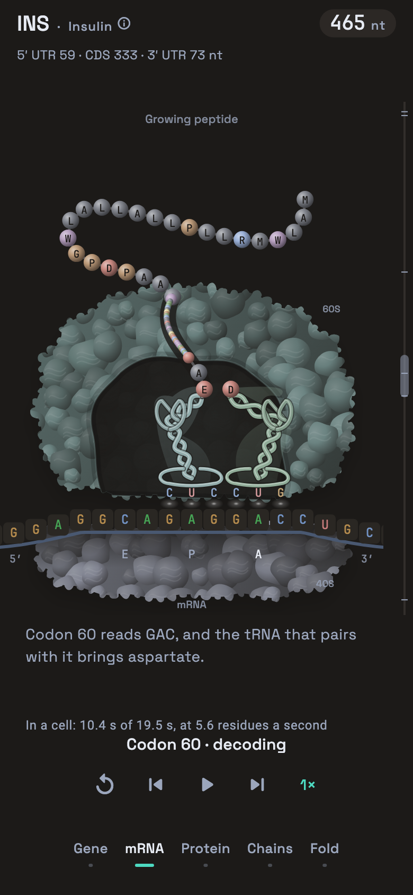

# Ribosome cutaway



## Design

The translation view now treats the ribosome as a substantial molecular body
surrounding a readable working space. A muted teal large subunit and a blue-grey
small subunit frame brighter tRNAs and amino acids. The outer surface has uneven
lobes, small protrusions, folded ridges and directional light. A recessed cut face
opens onto the tRNAs; a narrow channel leads from the catalytic centre to the
surface. These are procedural vector shapes, so every component can move.

The three supplied references informed different parts of the design: the first
for the irregular molecular envelope, the second for folded RNA stems and an
L-shaped body, and the third for the overall teaching view. No reference image
is embedded in the app.

## Scientific basis and its visual consequences

### Ribosome

The supplied 2WDK/2WDL illustration depicts a bacterial 70S ribosome. This app
shows human proteins, so the new labels use **40S** and **60S**, the subunits of
the human **80S** ribosome. Human structural work also shows an elaborate outer
RNA layer. The illustration borrows that irregularity, without claiming to
reproduce a particular atomic model. [Human ribosome structure, PDB 4V6X](https://www.rcsb.org/structure/4V6X)

RCSB's translation illustrations lighten the ribosome to expose molecules at the
subunit interface. Here, a dark cutaway serves that purpose on the app's dark
background. The small subunit aligns the message; the large subunit contains the
peptide-forming centre. The release factor is a protein with its own folded
silhouette, rather than an unlabelled copy of a tRNA. [RCSB ribosome guide](https://pdb101.rcsb.org/motm/121)

### tRNA and base pairing

A folded tRNA is L-shaped. The anticodon is at one end; an amino acid attaches to
the opposite, acceptor end. The drawing uses two interwoven stem strands and
compact loops at the elbow. Three exposed anticodon letters face their mRNA
codon. [RCSB transfer RNA guide](https://pdb101.rcsb.org/motm/15)

RNA is shown with **U**. The unchanged GenBank representation remains the source
of positions and sequences. For example, the screen presents 5′-AUG-3′ against
3′-UAC-5′, and insulin terminates at UAG. The three contact glows are a visual
cue for base pairing; they are not literal emitted light or a count of hydrogen
bonds. Unbound and scanning tRNAs do not show those contacts.

The initiator travels with the small subunit while it scans. It starts in P;
subsequent charged tRNAs arrive at A. Peptide transfer is followed by movement
through P toward E. A stop codon recruits a release factor, with no anticodon
letters or base-pairing glow. [Translation mechanism](https://www.ncbi.nlm.nih.gov/books/NBK9849/)

### Amino acids and the nascent chain

Residues are borderless spheres, lit from above and left. The existing app
palette retains the chemical groups used throughout the protein view:

| Group | Residues | App colour family |
| --- | --- | --- |
| Aliphatic | A, I, L, M, V | Neutral grey |
| Aromatic | F, W, Y | Lavender |
| Positive | H, K, R | Blue |
| Negative | D, E | Coral |
| Polar | N, Q, S, T | Green |
| Special | G, P | Tan |
| Cysteine | C | Yellow |

These are explanatory colours, not inherent molecular colours. The app uses
Zappo's grouping with its own muted palette. [Jalview colour schemes](https://www.jalview.org/help/html/colourSchemes/index.html)

The newest residue stays attached to the acceptor end; earlier residues pass
through the tunnel and emerge first. Outside the tunnel the chain follows a
smooth, gently moving curve. Nascent-chain experiments support substantial
mobility near the exit, but the motion here is illustrative: it does not predict
this protein's folding. [Nascent-chain motion and ribosomal contacts](https://pmc.ncbi.nlm.nih.gov/articles/PMC8556260/)

## Deliberate simplifications

- Shapes and relative scales prioritise a phone-sized view. The surface lobes
  are not individual atoms, and the tRNA drawing is not a nucleotide model.
- The existing timeline uses a fixed 35-residue tunnel capacity. Real occupancy
  depends on conformation; compressed beads make this model fit on screen.
- Long chains have a bounded visible tail and a count of residues beyond it.
- Elongation factors, GTP turnover, wobble pairing and hybrid tRNA states remain
  outside this teaching view. The E/P/A cycle and release remain explicit.
- Signal-peptide events remain in the captions. Residue borders were removed,
  including the previous signal-peptide rings, to preserve the clean spheres.

## Implementation and review

`translation_painter.dart` handles drawing order and the scientific state.
`translation_geometry.dart` shares positions between playback and the flight
into the protein grid. `translation_molecules.dart` records the detailed shell
as reusable vector pictures. `molecular_material.dart` supplies the sphere
lighting, which fades into the flat protein cells during the handoff.

Motion is a pure function of the translation state: pausing freezes it, seeking
reproduces it, and the final chain positions agree with the flight origins.
The picture scales to narrow or short canvases, with a bounded visible chain.

To inspect the real walk at 390 and 320 logical pixels:

```sh
RIBOSOME_DESIGN_SHOTS=/tmp/ribosome flutter test test/ribosome_design_render_check.dart
```

The captures cover scanning, joining, decoding, peptide transfer, translocation,
chain growth, termination, release and dissociation. Geometry tests check small
and short canvases, phase continuity, RNA lettering, and deterministic motion.

### Validation — 28 September 2026

- `flutter analyze`: clean.
- `flutter test`: 1,800 passed; 32 golden tests skipped by their native-platform guard.
- The capture check passed at both widths; the updated renderer was also
  hot-reloaded and inspected in the iPhone simulator.
- The pinned Linux/x86 Docker golden run passed 10 tests and failed 22. An
  isolated copy of starting commit `05e91be` produced the same 25 image
  mismatches, with byte-identical rendered images and identical pixel-difference
  reports. These existing baseline differences were preserved; no committed
  golden or existing walk test was changed.
