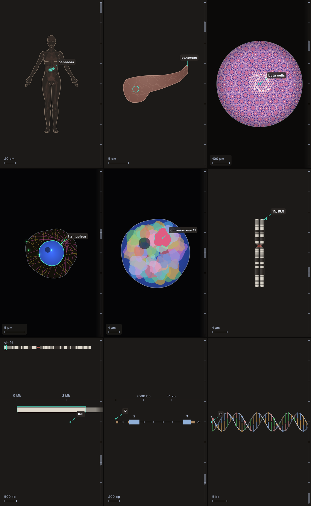

# Zoom: from a body down to one gene's DNA

## Experience

The zoom (`/zoom/<slug>`) dives from a whole body to the first bases of one
protein's gene, through nine stops: body, organ, tissue, cell, nucleus,
chromosome, band, gene and DNA. It is one continuous depth.

- **Getting there.** The walk's gene page offers "Zoom ›" beside its line,
  where the transcript offers "Ribosome ›", for a protein whose `locus`
  track is ready: the twenty curated ones today. It began as a Lab flow, and
  its links from then (`/lab/zoom/<slug>`) still open it.

- **Moving through it.**
  - A pinch moves the depth 2.5 for each tenfold spread of the fingers, and a
    flick coasts to the stop it would reach, settled by a critically damped
    spring.
  - A double tap goes one stop deeper.
  - The depth rail down the right edge is the walk's own `SequenceScrubber`,
    one landmark a stop. Dragging it scrubs the depth; letting go settles on
    the nearest stop.
  - The card's ‹ and › fly to the stop either side, in 350 ms plus 260 ms for
    each decade crossed, held between 450 and 2,600 ms and eased in depth.
- **Play.** ▶ plays the dive: 1.5 s at each stop and 0.9 s for each decade
  between, about 28 s from the body to the DNA. A touch on the canvas pauses
  it.
- **Reduced motion.** Steps and settles cut, and Play holds each stop for 3 s.
- **The card** names the stop and the place, gives one line of what is known
  of it, and tags where that comes from: `HPA 25.1`, `UCSC hg38`,
  `MANE v1.5`, `RefSeq record`, or `drawn` where the stop is illustration.
  Its height is the tallest stop's at the reader's text size, so the canvas
  keeps its size.
- **About (ⓘ)** says, once, what is drawn and what is data, and names every
  source with its licence.
- **At the DNA**, "Walk ›" goes back to the walk's gene page, the one it
  was opened from. A zoom opened by a link, with no walk under it, opens the
  walk there.

## Research and its consequences

Each stop is drawn in the convention of the instrument that shows its scale,
so a reader who knows the field reads it without a legend. What each
convention is, where it comes from, and what it decided:

- **Where a gene is read.** The Human Protein Atlas reads a gene's RNA
  tissue by tissue, cell type by cell type, and by cell type within a tissue,
  and finds its protein in the cell by immunofluorescence (Uhlén et al. 2015;
  Karlsson et al. 2021; Thul et al. 2017). The tissue reading and the single
  cell reading are separate analyses, so the top of one need not live in the
  top of the other. *Consequence:* the bake chooses one path, a cell that
  lives in the organ ("One path per gene").
- **Anatomy.** Expression Atlas shows expression on an anatomogram: a
  standing figure with a shape for each tissue, named by its UBERON id.
  *Consequence:* the body and the organ are those shapes, lit by the Atlas's
  level.
- **Histology.** Haematoxylin stains nuclei and ribosome-rich cytoplasm
  blue-purple; eosin stains protein pink; fat, mucus and lumens take
  neither. A ×40 objective under a standard eyepiece shows a field about
  half a millimetre across. *Consequence:* the tissue is that field, and
  each tissue's architecture is laid as the textbooks draw it (Junqueira's
  Basic Histology; Ross and Pawlina, Histology: A Text and Atlas).
- **A red cell has no nucleus.** It loses it as it matures in the marrow, in
  an island of erythroblasts round a macrophage (Chasis and Mohandas 2008).
  *Consequence:* where the Atlas's cell is a red cell, the zoom lands in an
  erythroblast of an island, and says so.
- **The cell.** The Atlas images a cell in four channels: the nucleus blue,
  microtubules red, the endoplasmic reticulum yellow, the protein green
  (Thul et al. 2017). *Consequence:* the cell is drawn in those channels,
  with microtubules moved to magenta so that red and green are never the
  only difference.
- **Chromosome territories.** In interphase each chromosome keeps to a
  territory of its own, and territories are ordered from the centre of the
  nucleus to its edge by gene density: chromosome 19 toward the centre, 18 at
  the edge (Croft et al. 1999; Boyle et al. 2001). Painting each chromosome
  its own colour shows them (Speicher et al. 1996; Schröck et al. 1996).
  *Consequence:* 46 territories in 24 colours, sized by their DNA and placed
  in that order.
- **Bands.** A chromosome is seen whole only when it condenses to divide,
  some ten-thousandfold. Giemsa stain then bands it, and a band's name
  (11p15.5) is the address cytogenetics gives a gene (ISCN 2020).
  *Consequence:* the chromosome is a metaphase chromosome at that length,
  the band is bracketed and named, and nothing claims the gene is seen
  there.
- **The gene's place.** Its span is that of its MANE Select transcript on
  GRCh38 (Morales et al. 2022), and its bands the UCSC Genome Browser's
  cytoBand table.
- **Nucleosomes.** 147 base pairs wrap a core of eight histones (Luger et
  al. 1997; Davey et al. 2002), about one core every 200. At the start of a
  gene that is read there is a stretch free of them, with a positioned
  nucleosome just downstream (Schones et al. 2008). *Consequence:* the gene
  is a fibre of cores 200 bp apart, bare at its 5′ end.
- **The helix.** A base pair every 0.34 nm, about ten and a half to a turn.

Sources:

- Boyle S et al. The spatial organization of human chromosomes within the
  nuclei of normal and emerin-mutant cells. Hum Mol Genet 2001;10:211–219.
- Chasis JA, Mohandas N. Erythroblastic islands: niches for erythropoiesis.
  Blood 2008;112:470–478.
- Croft JA et al. Differences in the localization and morphology of
  chromosomes in the human nucleus. J Cell Biol 1999;145:1119–1131.
- Davey CA et al. Solvent mediated interactions in the structure of the
  nucleosome core particle at 1.9 Å resolution. J Mol Biol
  2002;319:1097–1113.
- Expression Atlas, EMBL-EBI: anatomograms, CC BY 4.0
  (<https://www.ebi.ac.uk/gxa/licence.html>), which asks to be cited as
  "Expression Atlas in 2026: enabling FAIR and open expression data through
  community collaboration and integration", Nucleic Acids Research, 2025.
- ISCN 2020: An International System for Human Cytogenomic Nomenclature.
  Karger, 2020.
- Karlsson M et al. A single-cell type transcriptomics map of human tissues.
  Sci Adv 2021;7:eabh2169.
- Luger K et al. Crystal structure of the nucleosome core particle at 2.8 Å
  resolution. Nature 1997;389:251–260.
- Morales J et al. A joint NCBI and EMBL-EBI transcript set for clinical
  genomics and research. Nature 2022;604:310–315.
- Schones DE et al. Dynamic regulation of nucleosome positioning in the
  human genome. Cell 2008;132:887–898.
- Schröck E et al. Multicolor spectral karyotyping of human chromosomes.
  Science 1996;273:494–497.
- Speicher MR, Ballard SG, Ward DC. Karyotyping human chromosomes by
  combinatorial multi-fluor FISH. Nat Genet 1996;12:368–375.
- Thul PJ et al. A subcellular map of the human proteome. Science
  2017;356:eaal3321.
- Uhlén M et al. Tissue-based map of the human proteome. Science
  2015;347:1260419.

## Visual language

| Stop | Seen as | Its colours (`ScaleColors`) |
|---|---|---|
| Body, organ | anatomy, drawn | `bodyFill`, `bodyEdge`, `organ`, `organEdge` |
| Tissue | a stained section, brightfield | `brightfield`, `eosin` to `eosinDeep`, `haematoxylinLight` to `haematoxylin`, `redCell`, `eyepiece` |
| Cell | immunofluorescence | `fluorescence`, `dapi`, `reticulum`, `microtubules`, `protein`, `membrane` |
| Nucleus | chromosome paint | `paint` (24), over `dapi` |
| Chromosome | Giemsa bands | `giemsaPale`, `giemsaDark`, `centromere` |
| Band, gene | a genome browser | the walk's own: `roleCds`, `roleUtr5`, `roleIntron` |
| DNA | a fibre of nucleosomes, then the helix | `histone`, `backbone`, the walk's base colours |

- **One mark.** Whatever the zoom follows is in the theme's primary colour,
  at every stop: the organ's ring, the place it is sampled, the cell's
  outline, its nucleus, the territory, the band's bracket, the gene.
- **One name a stop.** A plate with a line to what it names, set clear of
  the rail and of each other. The card says the rest.
- **Light and dark.** The body, the organ and the genome are on the app's
  own dark ground; the tissue is the lamp's light in the eyepiece's dark;
  the cell and the nucleus are fluorescence on black. The ground changes
  with the instrument, and each change is a beat of the dive: the loupe
  opening, the dark spreading from the cell.
- **Lines** are set in screen pixels, so they keep their weight at any
  magnification.

## One path per gene

The organ and the cell are not chosen by the app. The `locus` track's schema 2
(`pipeline/locus/` in the backend) chooses them, by one rule from the Human
Protein Atlas's readings:

- the organ is the tissue the RNA is highest in;
- the cell is one that lives there: the Atlas's own tissue cell type pair
  for that tissue, else the highest single cell type whose home it is, else
  none, and the tissue's own cells are drawn and said to be;
- a gene specific to no tissue goes to its top cell type's home;
- a cell with no nucleus lands in the one that has one.

Schema 1 took the top tissue and the top cell type each on its own, and seven
of the twenty went down into a cell of another organ: TNF's bone marrow into
microglia, myoglobin's skeletal muscle into thymic myoid cells. The bake's
README tabulates all twenty paths. A schema 1 payload still reads, with the
old rule.

## The camera

Each stop is a scene drawn in its own units: the width of the view at its
stop is one unit, and its origin is the middle of that view. Between two
stops the view narrows by the segment's factor, logarithmically in depth.

Each scene says where the next stop lies in it (its portal). The camera is
worked out from where the portal is on screen: the portal's offset from the
centre shrinks to nothing over the first 60% of a segment (a smootherstep),
and the centre follows. So the target never leaves the view, and every value
is a continuous function of depth. `zoom_domain_test` holds the portal on
screen and the view smooth across every segment of four genes, and holds the
scene two segments share to the same place at the stop between them.

- **Travel.** A segment's depth is its decades, but at least 0.6. The step
  from the nucleus to a long chromosome is only 0.07 decades: chromosome 1
  condensed is almost as wide as the nucleus, so it would otherwise flash by.
- **Units.** The view reads in metres down to the chromosome and half way
  past it, then in base pairs. The band, the gene and the DNA are placed in
  base pairs, projected to the screen in doubles, so no canvas transform
  carries the 10⁸-fold narrowing.

## The body and the organ

**The figure.** The body is the Expression Atlas anatomogram's standing
figure (EMBL-EBI, CC BY 4.0): its line art, and inside it a shape for every
tissue, named by UBERON id. `tool/zoom/anatomogram.py` reads the three
drawings (female, male, and a brain in four views) at one pinned commit,
holds each to its digest, and writes
`lib/features/zoom/domain/anatomy_figures.g.dart`: every outline
simplified (Ramer-Douglas-Peucker) and measured in metres on a figure 1.70 m
tall, only the tissues `anatomy_tables.dart` names kept, of the brain only
its mid-sagittal view. About 95 KB of source for all three. `--check` fails
if the file is stale.

The outlines are compiled in rather than bundled: the app's asset list is
held to three files by a walk test, and the figures are code-sized.

**Which figure.** A tissue only one sex has is shown on that body: the
fallopian tube on the female figure, the testis on the male. Any other is
on both, and the figure is then the one that has more of the other tissues
the gene is raised in, the female where they tie
(`AnatomyFigure.bodyFor`). So a gene of the liver alone is shown the female
figure, and nothing is meant by it.

**What is lit.** The organs are faint inside the figure. Lit are the tissues
the Atlas reads the gene's RNA raised in, each as bright as its level
against the highest: myoglobin's skeletal muscle fully, its heart and tongue
less. The one the zoom goes into is ringed, and found by a dot while it is
too small to see. Skin is lit as the figure's own edge.

**Seen through.** On the way in the line art gives way and the organs come
up, as if the body were seen through.

**One outline, two scenes.** The organ's scene draws the very outline the
body drew for it (`OrganArt`), so the step is one shape seen closer. It
comes up over the body's own drawing of the organ early in the step, and
`zoom_anatomy_test` holds the two to the same point of the screen while both
show.

**Its real size.** The anatomogram is a diagram: it draws a stomach 11 cm
long and a pancreas 9. Each organ therefore knows how many times its drawn
size it really is, and grows to that over the second half of the step, as
the body fades round it. At the organ's stop the scale bar is true of it.
The view closes on the organ's middle, so it stands whole in the view, and
a ring marks where in it the tissue is sampled: the point inside its outline
farthest from its edge.

**Its surface.** An outline is given the surface of the kind of organ it is:

| Look | Organs |
|---|---|
| lobules | pancreas, liver, glands, testis, ovary, prostate, breast, placenta |
| a wall round a lumen | stomach, bladder, gallbladder, uterus, tube, gullet |
| fibres | muscle, heart, tongue |
| airways from the hilum | lung |
| cortex and pyramids | kidney |
| marrow in its cavity | the femur, for bone marrow |
| lobes | fat |
| coils | intestine, epididymis, seminal vesicle |

The other shapes of the same part (the other lung, the other kidney) stand
beside it, fainter.

**Not from the anatomogram.** Where it has no outline that shows the tissue,
the organ is drawn from general anatomy: a lymph node (capsule, follicles,
medulla, vessels in and out) for "lymphoid tissue", a length of artery, a
block of skin, a parathyroid gland on the back of the thyroid, the eye cut
level with the retina lining it. The brain is the anatomogram's own brain
cut down its middle, with the cortex lit, or the lateral ventricle for the
choroid plexus, which lies in it.

**The glide.** The camera carries the organ from where it lies in the body
to the middle of the view over the first three fifths of the step. From the
head or the thigh that is a long way, and `zoom_smoothness_test` plays the
protein whose organ lies farthest from the body's middle at 60 fps.

## The tissue

**The convention.** The tissue is a section stained with haematoxylin and
eosin, as a pathologist reads one: nuclei purple, cytoplasm and matrix pink,
lumens, fat and vessels the lamp's own light, red cells red. It is seen in
the round field of an eyepiece, 500 µm across (what a ×40 objective shows),
which darkens toward its edge and stands clear of the rail.

**One engine, a recipe an architecture.** `TissueSlide` lays a slide once,
in micrometres, from the tissue's recipe: each of the Atlas's 37 tissues has
one of 24 (`tissueAnatomy`). The engine (`SlideBuilder`) is seeds and the
Voronoi cells round them, relaxed so they pack as cells do, an epithelium set
cell by cell along a line, vessels, and fibres, all from one seeded
generator, so a tissue is the same slide every time. Sizes are the tissue's
own: a hepatocyte 24 µm, a fat cell 66, a seminiferous tubule 190 across.

| Recipe | Tissues | What is laid |
|---|---|---|
| acinar | pancreas, salivary gland | acini edge to edge, purple at the base and pink at the apex, a pinpoint lumen; an islet among them, or a duct in its sheath, where the cell is of one |
| hepatic | liver | plates one or two cells thick running out from a central vein and branching, sinusoids with their lining cells and red cells |
| endocrine | pituitary, adrenal, parathyroid | nests of acidophils, basophils and chromophobes, sinusoids between the nests |
| follicular | thyroid | follicles of colloid walled by cuboidal cells |
| gastric, renal | stomach, kidney | glands or tubules cut across; the kidney's about a glomerulus |
| seminiferous | testis | tubules: spermatogonia and Sertoli cells, spermatocytes, round then elongating spermatids, tails in the lumen; Leydig cells between |
| choroidPlexus, placental | choroid plexus, placenta | fronds or villi cut every way, a capillary core in each; the mother's blood round the villi |
| glandular, intestinal | tube, uterus, prostate, breast…; intestine | a mucosa in folds, ciliated, more folds free in the lumen; or villi with goblet cells and crypts |
| squamous, urothelial | skin, gullet, cervix, vagina; bladder | layers on a wavy floor, flattening to the surface; or the bladder's, with large cells on top |
| alveolar | lung | air spaces, capillaries in their walls |
| lymphoid | lymphoid tissue | a node's edge: fat, capsule, the sinus under it, cortex and a follicle |
| vascular | blood vessel | an artery's wall along its length |
| marrow | bone marrow | blood-forming cells, fat cells, megakaryocytes, a sinusoid |
| skeletalMuscle, cardiac | muscle, tongue; heart | fibres along their length, striated |
| neural, retina | brain; retina | grey matter; the retina in its layers, vitreous to choroid |
| adipose | fat | fat cells edge to edge |
| smoothMuscle, ovarian | smooth muscle; ovary | spindle cells in sheets, or streaming in whorls |

**The zoom's cell belongs where it sits.** It is drawn at the middle in the
same outline the cell's scene draws (`cellOutline`), ringed, and the recipe
lays the tissue about it:

- an acinar cell is one of a ring, its apex on the lumen; a beta cell is in
  an islet; a duct cell in a duct's ring;
- a hepatocyte is in a plate, the lobule turned so that a file runs through
  it;
- an erythroblast is in its island, the one the cell's scene shows: the
  macrophage, the brood round it, the grown red cells leaving;
- a muscle fibre runs across the whole field, striated every 2.5 µm as it is
  in the cell's scene, its other nuclei where that scene has them;
- a ciliated cell stands on a fold with its apex to the lumen; a plexus
  cell on a frond;
- a spermatocyte is in the second layer of a tubule's wall; a lymphatic
  endothelial cell lines the sinus's floor; a dividing cell is in a gastric
  gland.

Where the path names no cell that lives in the tissue, the tissue's own
principal cell is drawn there.

**Layers.** A slide is five layers, each drawn whole over the one before:
what lies under the cells, the cells, two for what is laid over them, and the
zoom's own cell. In a layer the inks go down in one order: matrix and
cytoplasm, granules, striations, borders, fibres, lumens, nuclei, red
cells.

**The loupe.** From the organ, the field opens as a loupe on the place the
organ is sampled: a circle that grows from 56 px to the eyepiece's field
while it shows 0.3 and then 0.83 of the scene, so the magnification barely
changes, the organ dimming round it. It meets the camera's own scale at the
tissue's stop. A step of some hundredfold becomes a change of instrument.

**Into the cell.** The slide is paths, not a picture: as the view closes on
the cell it stays sharp, and a fibre's striations and an acinus's cells come
up to meet the cell's own scene, whose dark field spreads out from the same
outline.

## The cell and its nucleus

**The cell's convention.** The cell is drawn in immunofluorescence, the way
the Human Protein Atlas images cells:
- DNA in blue (DAPI);
- the endoplasmic reticulum in yellow;
- microtubules in magenta, not the Atlas's red, so a reader who cannot tell
  red from green can still tell them from the protein;
- the protein in green, where the Atlas finds it: brighter at its main
  locations, fainter at its additional ones. Each of the Atlas's 49
  subcellular words is drawn in a compartment (`compartmentOf`).

A protein the Atlas finds secreted leaves the cell in vesicles from the Golgi,
moving with an ambient clock that is still under reduced motion. Where the
Atlas gives no location, no green is drawn, and the callout names the
nucleus the zoom goes to next. Otherwise it names the main locations.

**Shapes.** The cell's shape is its kind's, chosen from the Atlas's class,
with refinements by name (`cell_archetypes.dart`):

| Shape | Look |
|---|---|
| hepatocyte | polygonal |
| acinar | pyramidal |
| endocrine | rounded |
| ciliated | columnar |
| endothelial | flat |
| neuron | dendrites and an axon |
| myofibre | striated, its nuclei along its rim |
| adipocyte | one lipid droplet, its nucleus pressed to the rim |
| erythroid | the erythroblastic island |
| megakaryocyte, leukocyte, germ cell, dividing cell, trophoblast | their own shapes |

Each has a real size, and so do their nuclei. The nucleus view is widened to
fit a long chromosome condensed, and the cell view to fit its nucleus, so the
dive never turns back: a metaphase chromosome 1 is longer than a small
nucleus is wide.

**No nucleus.** A cell type with no nucleus lands in its precursor's island,
in the marrow: a macrophage, erythroblasts round it at every stage (the last
pushing out its nucleus), and grown red cells leaving it, the biconcave discs
named "red cells: no nucleus".

**Transitions.** Coming in from the tissue, the dark of the fluorescence field
spreads out from the cell. The cell's nucleus and the nucleus's own share one
outline (`NucleusShape`): round, a lens, a crescent or lobed. So the step
between them changes no shape. On it, the DNA stain resolves into chromosome
paint.

**The nucleus** holds 46 territories:
- each as large as its chromosome's DNA (hg38 lengths);
- gene-dense chromosomes toward the centre and gene-poor ones at the rim;
- the five acrocentrics round the nucleolus;
- pores in the envelope once there is room to see them.

The followed territory is the outline the chromosome condenses from.

## The molecular end

**Chromosome.** At its stop the chromosome is a metaphase chromosome:
- two sister chromatids, pinched together at the centromere where its `acen`
  bands meet;
- stalks drawn thin, and `gvar` hatched as ideograms draw it;
- the G-bands lit from the upper left across each chromatid;
- an ISCN bracket beside the band the gene lies in, and the band's name on
  the callout.

It is never the gene: the band is millions of base pairs, a stain pattern
seen at low resolution, and the About sheet says the gene is far too small
to see in it.

**Condensing.** On the way in, the chromosome condenses out of its territory.
The nucleus hands its followed territory to the chromosome's scene at the
first frame of the segment, where the two coincide. The territory's outline
blends into the chromosome's, resampled to 128 points from the top. The
chromosome paint gives way to Giemsa's grey, the bands come up, and the two
chromatids resolve out of one shape at the end. The step from the nucleus to
a long chromosome is a beat in time more than a change of scale (0.07
decades for chromosome 1), and the minimum travel gives it its room.

**Into the map.**
- On the way out, the chromosome turns about its band to lie along the
  genome, short arm to the left as genome browsers draw it. Its chromatids
  merge and it thins to the band strip's 18 px, all over the first 35% of
  the segment.
- The band's strip appears exactly where the turned chromosome lies: at
  that moment the chromosome's length on screen and the strip's length of
  genome are the same number of pixels, by the camera's own arithmetic. The
  two cross-fade over half the segment.
- The strip then rises, a ruler in base pairs comes up, and the whole
  chromosome docks above with the view boxed on it. The scale bar changes
  from µm to Mb half way.

**Gene.**
- The record's exons and introns are at their real lengths (`GeneLayout`
  uses `realIntronBp` for the three genes whose record shortens its
  introns), placed along the span MANE gives.
- Coding exons are thick and numbered once they are 16 px wide. Their
  untranslated ends are thin. Introns are a line with chevrons in the
  direction the gene is read.
- A ruler counts from the 5′ end.
- The gene reads 5′→3′ left to right, as the walk does, from the moment it
  appears.
- A turn of reverse-strand genes was planned and dropped. The band draws
  the gene as a featureless bar, so there is nothing to see turn, and the
  turn swung dystrophin's 5′ end across the view by up to 3 px a frame,
  past the smoothness bound.

**DNA.**
- Past a few thousand base pairs, the gene's line is a fibre of
  nucleosomes: a core of 147 bp seen side on, its DNA passing behind and in
  front of it, one every 200 bp. The first sits 40 bp into the gene and the
  stretch before it is bare.
- Beads come up once they read as beads and give way before one fills the
  view.
- Under 400 bp the bare 5′ end resolves into the double helix with the
  record's own first 33 bases, which turns once in 16 s while the DNA is
  near.
- "Walk ›" unzips it into the walk's rows (`HelixModel(unzip:)`) over
  450 ms before the walk opens.

## Smooth motion

Every value on screen is a function of depth, and the staging each scene
reports is what `zoom_smoothness_test` walks:
- every protein's dive at 6,000 steps of depth;
- Play at 60 fps for three of them, and for the one whose organ lies
  farthest from the body's middle.

It fails on:
- anything that appears, vanishes or changes by more than 0.08 opacity in a
  step;
- anything near the focus whose position's second difference passes
  1.5 px. Further out, things fly outward faster the further they are as
  the view narrows, and the test checks for a break rather than a bound.

What it found, and what was changed:
- **Play's legs.** A 0.6-decade segment once took 0.54 s of Play, so its
  crossfade ran in six frames. Every leg is now at least 1.4 s.
- **Fade windows.** Every scene's fade now spans at least 45% of its
  segment.
- **Callouts** show around their own stop, over the last and first 35% of
  the segments either side. They run on segment progress, not on how big
  the scene is drawn, because across a six-hundredfold segment the scene's
  size races while the depth eases in and out.
- **The lesser of two fades.** Where a callout's fade meets its scene's,
  the lesser of the two is taken, not their product, which compounded into
  a snap.
- **The portal's glide** to the centre takes three fifths of the segment
  rather than 35%, so it stays gentle inside Play's own ease, from as far
  as the head is from the middle of a body.

`zoom_smoothness_test` also places every stop's callouts at 390 and 320
wide and fails if two plates overlap or one lies under the rail.
`placePlate` tries the corners round the target in turn.

## Deliberate simplifications

- **The figure is a diagram.** Organs lie and overlap as the anatomogram
  draws them, from the front. Bone marrow is its femur, sampled where the
  outline is widest; a biopsy is taken from the pelvis.
- **One field a tissue.** Wherever in the organ it is cut, and for every
  gene that goes there with the same kind of cell. "Lymphoid tissue" is a
  lymph node, and skin has no keratin layer of its own.
- **Flat stains.** No chromatin texture, no variation in section thickness.
- **A cell of its kind.** The cell is its kind's shape and size, not a
  measured cell, and the green fills the compartments the Atlas names
  rather than reproducing its image.
- **Territories are placed, not measured.** Their order from centre to edge
  is the literature's; their places are drawn. A male figure's nucleus holds
  an X and a Y, a female's two X.
- **A dividing chromosome in a resting nucleus.** The chromosome is seen
  condensed although the cell is not dividing: the territory condenses into
  it, and the step says why it is shown so.
- **Textbook packing.** Nucleosomes are drawn every 200 bp from 40 bp into
  the gene, not where they sit on this gene.
- **One body.** A gene of tissues both sexes have is shown the female
  figure, unless more of its tissues are the male's alone.

## Implementation and checks

- `domain/zoom_depth.dart`: the stops, travel, widths and units.
- `domain/zoom_camera.dart`: the nested views.
- `domain/zoom_motion.dart`: flights, the flick and Play.
- `domain/zoom_facts.dart`: the card and About.
- `domain/gene_layout.dart`: the gene's parts at real length.
- `domain/anatomy_tables.dart`: tissues to organs, recipes, sizes and
  territories.
- `domain/anatomy_figure.dart`, `anatomy_figures.g.dart`: the anatomogram's
  figures, and `tool/zoom/anatomogram.py`, which makes them.
- `presentation/scenes/organ_art.dart`: every organ's drawing.
- `presentation/scenes/`: one scene a stop.
- `presentation/scenes/tissue/`: the slide (`tissue_slide.dart`), the engine
  (`slide_builder.dart`) and the recipes (`recipes_glands.dart`,
  `recipes_linings.dart`, `recipes_bulk.dart`).
- `presentation/zoom_painter.dart`: the visible scenes, the callouts and the
  scale bar.
- `presentation/zoom_rail.dart`, `zoom_card.dart`, `zoom_about.dart`,
  `zoom_screen.dart`.
- `zoom_routes.dart`: its route, in every build, and the redirects from its
  Lab links. The walk opens it by that route (`RoutePaths.zoomFor`), with
  `?over=walk` so that "Walk ›" pops back.
- Colours: `ScaleColors` in `lib/core/theme/scale_colors.dart`, read through
  `context.scaleColors`. `AppTheme.analysis` is unchanged.
- Render check:
  `ZOOM_DESIGN_SHOTS=/tmp/zoom flutter test test/zoom_design_render_check.dart`
  writes every stop and two moments in each segment, at 390 and 320 pixels.
  `ZOOM_GENES` narrows the proteins. `ZOOM_TISSUE_ATLAS=/tmp/atlas` writes
  every recipe's slide on its own and `ZOOM_ORGAN_ATLAS=/tmp/organs` every
  tissue's organ, the ones no catalog protein reaches included.
- `tissue_slide_test` lays every recipe about every kind of cell (432
  slides) and holds the zoom's own nucleus to be the only one at the middle,
  a tissue to be the same slide every time, the field clear of the rail, and
  the cell's name to land on its outline.
- `zoom_anatomy_test` holds every protein's organ to a figure that has it,
  the lit organs to the Atlas's reading, and the organ's scene to the
  outline the body drew. `zoom_domain_test` holds the figures themselves:
  1.70 m tall, every part inside its figure with its site inside it, and
  the generated file to its source, commit and licence.
- `zoom_routes_test` holds the route outside the lab, the redirects, and the
  whole trip from the walk and back under the app's own routes.
  `zoom_entry_test`, among the walk's tests, holds where the gene page
  offers it and that every gene's line stays whole beside the pill.
